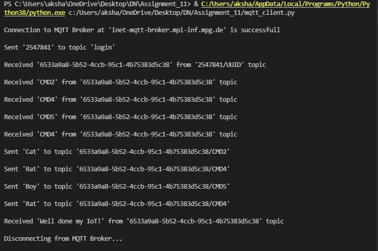

# Message Queuing Telemetry Transport Client

The MQTT protocol is a machine-to-machine (M2M)/Internet of Things connectivity protocol. Designed as an extremely lightweight publish/subscribe messaging transport, it is useful for connections with remote locations where a small code footprint is required and/or network bandwidth is at a premium.

The MQTT client application is built using Python & Eclipse Paho MQTT Client library.

## Connection Details

|   MQTT Broker URL | Port  | Username  |   Password    |
|-------------------|-------|-----------|---------------|
|   inet-mqtt-broker.mpi-inf.mpg.de |   1883    |   student |   i_make_mqtt_cool    |

## Description

**The application respects the following protocol:**

1. Connect to the broker.
2. Send a message containing **User ID** to the topic 'login'.
    > **Example:**  
    >   Topic = 'login'  
    >   Message = '12345'

3. Once we have sent the message to 'login', we shall receive a message on the topic '**User ID**/UUID'. The message will contain a **UNIQUE ID**.
    > **Example:**  
    >   Topic = '12345/UUID'  
    >   Message = '1234-fdsfs-12441-qa241'

4. After 3 seconds from the publishing of the **UNIQUE ID** by the broker, we start receiving multiple messages/commands on the topic '**UNIQUE ID**' with different commands.
    > **Example:**  
    >   Topic = '1234-fdsfs-12441-qa241'  
    >   Message = 'CMD1'

5. For each command we should send a specific reply (check the commands and the replies below) to the following topic: '**UNIQUE ID**/**CMD**'.
   |   Command  | Expected Reply  |
   |------------|-----------------|
   |    CMD1    |   Apple   |
   |    CMD2    |   Cat |
   |    CMD3    |   Dog |
   |    CMD4    |   Rat |
   |    CMD5    |   Boy |
   |    CMD6    |   Girl    |
   |    CMD7    |   Toy |

    > **Example:**  
    >   Topic = '1234-fdsfs-12441-qa241/CMD1'  
    >   Message = 'Apple'

6. Once all the commands are handled and replies are sent (respecting the **Quality of Service** (**QOS**) level), we shall receive the following message from broker: '**Well done my IoT!**' on the topic '**UNIQUE ID**'.
   > **Example:**  
    >   Topic = '1234-fdsfs-12441-qa241/CMD1'  
    >   Message = 'Apple'

7. Once we receive this message, the communcation is over and we can disconnect from the broker.

   **Note:**  
   We will receive a random number of commands from the list above. They can come repeatedly and in any order. There will be no more commands after the final message is received!  

## Requirements

1. paho-mqtt

    To run the code, you must install Python 3 & the above packages can be installed by running the below command:  
    > pip install -r requirements.txt

## Execution Steps

1. Clone the repository to your computer/raspberry pie.
2. Run MQTT Client: 'python mqtt_client.py'.

## Communication Logs

1. **Scenario 1 (PNG):**  

   

2. **Scenario 2 (GIF):**  

   

   **Note:**  
   In this scenario, the reply from MQTT client is sent twice. This is because of the **QoS** level set during the connection establishment phase.

## References

   1. [MQTT Essential Series](https://www.hivemq.com/mqtt-essentials/)

## Author

[Akshay Joshi](https://akshayjoshi.tech)
